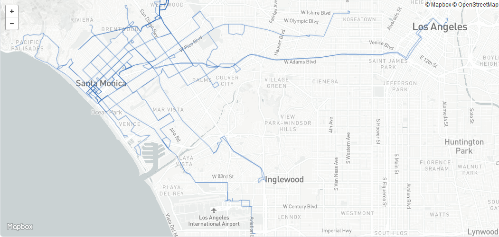
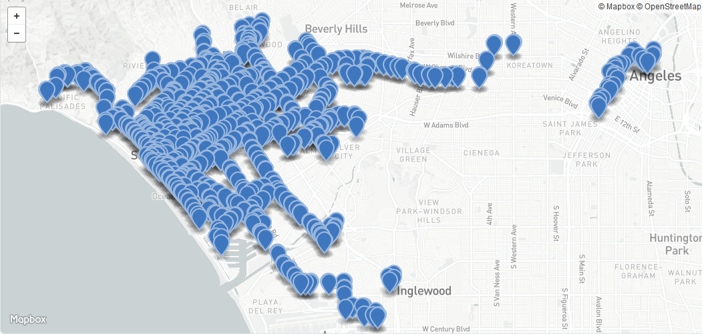
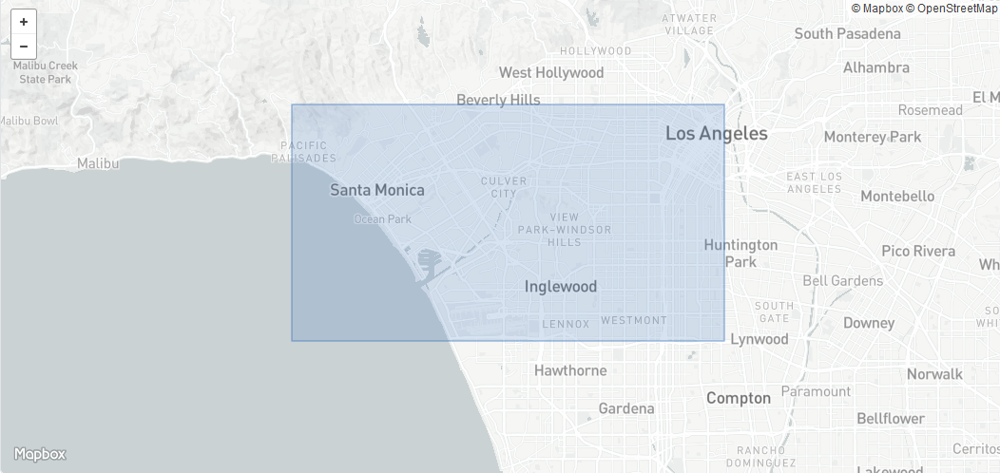
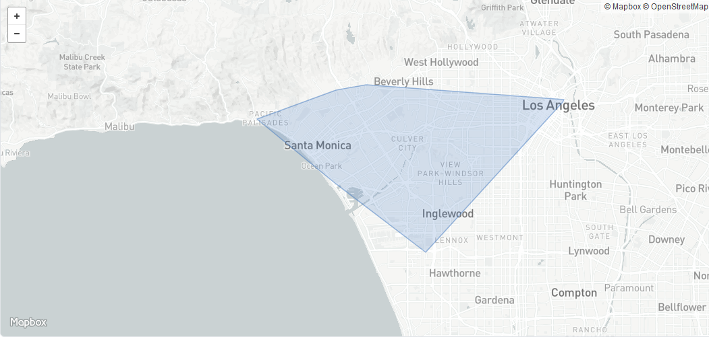
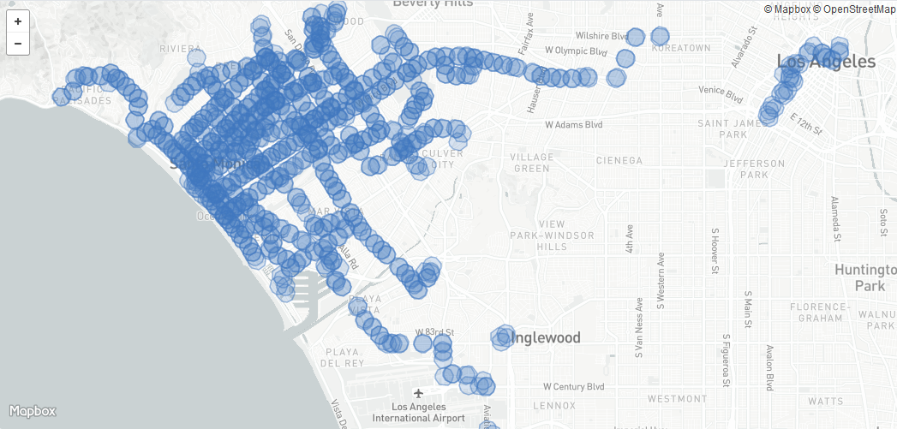
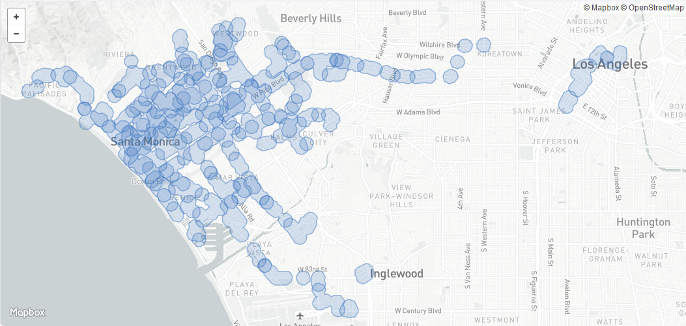
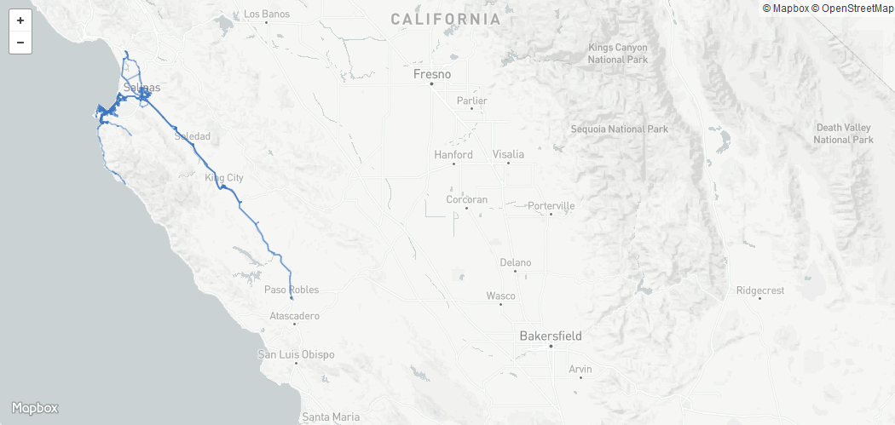
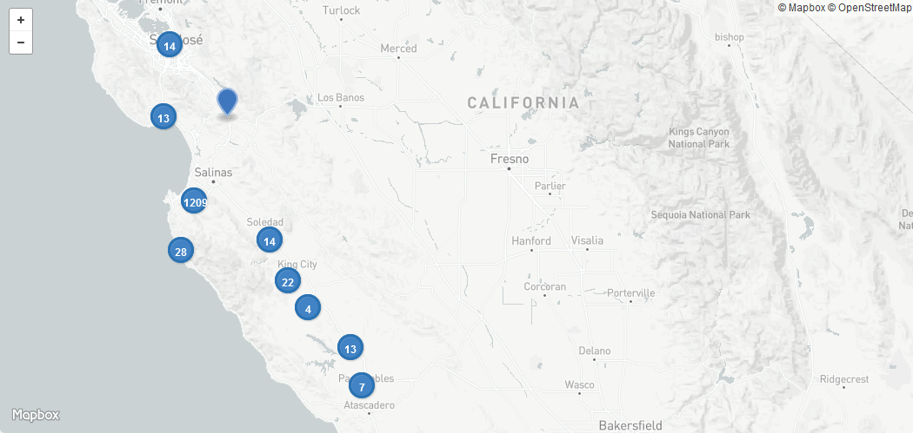
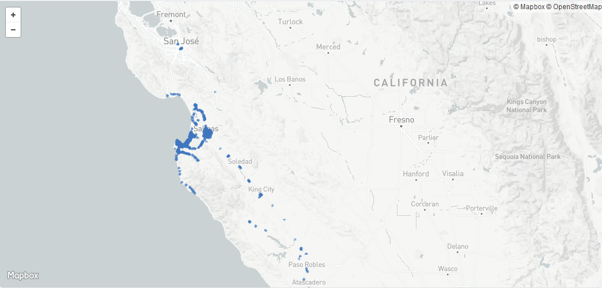
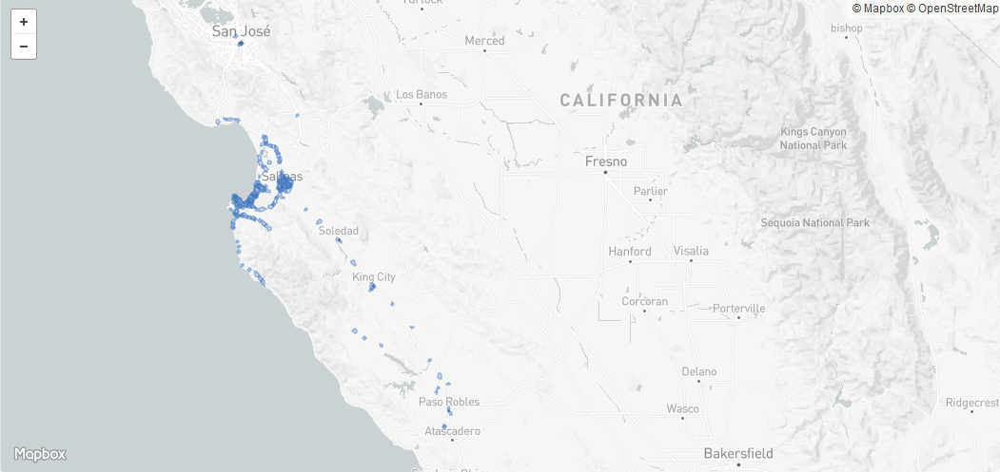

# Examples

This directory contains example output for a couple Agencies in California.

| Agency                          | File                                                                     | Screenshot                                                          |
|---------------------------------|--------------------------------------------------------------------------|---------------------------------------------------------------------|
| [Big Blue Bus][bbb]             | [Route lines](bbb/bbb-routes.geojson)                                    |                                    |
| [Big Blue Bus][bbb]             | [Stop points](bbb/bbb-stops.geojson)                                     |                                      |
| [Big Blue Bus][bbb]             | [Bounding box of route lines](bbb/bbb-envelope.geojson)                  |                            |
| [Big Blue Bus][bbb]             | [Convex hull from route line endpoints](bbb/bbb-convex.geojson)          |                               |
| [Big Blue Bus][bbb]             | [Buffered Stop points](bbb/bbb-buffer-stops.geojson)                     |                      |
| [Big Blue Bus][bbb]             | [Dissolved buffered Stop points](bbb/bbb-buffer-stops-dissolved.geojson) |  |
| [Monterey-Salinas Transit][mst] | [Route lines](mst/mst-routes.geojson)                                    |                                    |
| [Monterey-Salinas Transit][mst] | [Stop points](mst/mst-stops.geojson)                                     |                                      |
| [Monterey-Salinas Transit][mst] | [Buffered Stop points](mst/mst-buffer-stops.geojson)                     |                      |
| [Monterey-Salinas Transit][mst] | [Dissolved buffered Stop points](mst/mst-buffer-stops-dissolved.geojson) |  |

[bbb]: http://gtfs.bigbluebus.com
[mst]: https://mst.org/about-mst/developer-resources/
